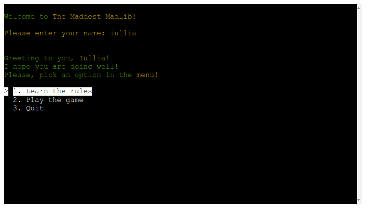

# The Maddest Madlib


*The link to [the Maddest Madlib](https://the-maddest-madlib.onrender.com)*

The Maddest Madlib is a Python terminal project whose primary purpose is to boost users' moods and provide various experiences.

Secondarily, it may help users to practice English grammar.

Users can quickly learn the rules of the game and type any words according to the provided instructions. In the end, they will receive a story that includes all words from the user's input, which are modified according to the English grammatical rules as much as possible to fit in the story.

---

## How to play:

  1. Click this *[link](https://the-maddest-madlib.onrender.com)* or copy this text: `https://the-maddest-madlib.onrender.com` and paste it in your browser's address bar.
  1. As soon as the page is loaded, click 'RUN PROGRAM'.
  1. Introduce yourself to the program.
  1. Learn the rules.
  1. Type the words according to the instructions.
  1. Read the story gradually by hitting 'Enter' on your keyboard and have some fun.
  1. Play one more time and try to enter different words to have even more fun.
  1. As soon as you are sick and tired of the game, choose "Quit" and **send** the link to this program to your friends!

  Link to the game: *https://the-maddest-madlib.onrender.com*

---
## User Stories
### First Time Visitor Goals:

* As a First Time Visitor, I want to quickly understand the program's primary purpose so that I can learn more about this program.
* As a First Time Visitor, I want to navigate through the program easily so that I can find the content.
* As a First Time Visitor, I want to find the program useful for myself so that I can fulfill my expectations.
* As a First Time Visitor, I want to see different text colors so I can easily read the story.

### Frequent Visitor Goals:
* As a Frequent User, I want to be able to use different words for the inputs so that I can receive various experiences.
* As a Frequent User, I want the stories to be readable all the time so that I can read stories without difficulties. 

---

## Features
  
  - **When the program is loaded**

  The user can see a welcoming message which engages to start playing and the 
  polite question to enter the user's name:
  
  

  - **When the user types a name.**

  - Sends personal greetings and short instruction on the next step;

  - Shows the terminal menu with three options:

    1. Learn the rules;

    1. Play the game;

    1. Quit;

      

  The user can manipulate the terminal menu with the arrow keys to choose an option and the enter key to confirm the choice.

  - **When the user chose "Learn the rules"**

  The user will see the main rules of the game which are required to be followed.
  Below the rules, the user can find the main menu where he or she may choose another option.

  

  - **When the user chose "Play the game"**

  The program will show the sub-menu with the following options to choose from:

  1. Story 1: "Absolute Madness";

  1. Story 2: "Slight Madness";

  1. Go back;

  

  Here the user can choose which story is preferable to play or go back to the main menu.

- **When the user chose a particular story**

  The program alerts the user to be ready to type the words.

  

  Then, the user will be asked to type words according to the parts of speech. The user is allowed to use compound words to make the user's experience more fascinating.
  When all words are typed, the user will receive the whole story based on the keywords which he or she typed before.
  Below the story, the user can find the main menu where he or she may reread the rules, play another game, or quit the program.

  
  

  - **When the user chose "Quit"**


  The user will see a goodbye message, and the program will be stopped.

  

---

## Flowchart

The flowchart represents the logic of the application:

  


---
## Technologies Used

### Languages:

- [Python 3.8.5](https://www.python.org/downloads/release/python-385/): used to anchor the project and direct all application behavior

- [JavaScript](https://www.javascript.com/): used to provide the start script needed to run the Code Institute mock terminal in the browser

- [HTML](https://developer.mozilla.org/en-US/docs/Web/HTML) used to construct the elements involved in building the mock terminal in the browser

### Frameworks/Libraries, Programmes and Tools:
#### Python modules/packages:

##### Standard library imports:

- [random](https://docs.python.org/3/library/random.html) was used to implement pseudo-random number generation.
- [os](https://docs.python.org/3/library/os.html ) was used to clear the terminal before running the program.
##### Third-party imports:

- [NLTK Package](https://www.nltk.org/) was used in order to be able to work with pattern package.
- [Pattern Package](https://stackabuse.com/python-for-nlp-introduction-to-the-pattern-library/) was used to pluralize nouns where it is needed.
- [Simple Terminal Menu](https://pypi.org/project/simple-term-menu/) was used to implement the menu.
- [Colorama](https://pypi.org/project/colorama/) was used to add colors and styles to the project.

#### Other tools:

- [VSCode](https://code.visualstudio.com/) was used as the main tool to write and edit code.
- [Git](https://git-scm.com/) was used for the version control of the website.
- [GitHub](https://github.com/) was used to host the code of the website.
- [GIMP](https://www.gimp.org/) was used to make and resize images for the README file.
- [Draw.io](https://www.lucidchart.com/) was used to make a flowchart for the README file.


---

## Bugs

+ **Solved bugs**


1. The function ```choosing_article(word)``` did not give the correct article if the noun was uncountable.

    - *Solutions:* rewrote function with using args; rather than checking only the beginning of the word, it checks all arguments and presents the correct  article

     ```python
    def choosing_article(*words):
        """
        Checks which article to use before the word and place the article before it
        """
        # Checks if the last word is countable.
        #If it is uncountable, returns all words
        if words[-1] in uncountable_nouns:
            return ' '.join(words)
        else:
            # Checks if the word starts with a vowel, adds 'an' before the word
            if words[0][0] in dictionary_letters['vowels']:
                return 'an ' + ' '.join(words)
            # Otherwise, adds 'a' before the word
            else: 
                return 'a ' + ' '.join(words)
      ```

1. Conjugate function did not work due to the RunTimeError raised by Python.

    - *Solutions:* add function which runs the function at first raising this error and then passes this error.

     ```python
    def run_the_time_error():
        """
        Prevent "RuntimeError: generator raised StopIteration"
        The package has raised StopIteration that was missed in python earlier versions.
        Thus, it had worked before Python version 3.7 was introduced.
        Since the package has not been updated since August 2018, it raises the error and stops the app.
        "PEP 479 is enabled for all code in Python >= 3.7, meaning that StopIteration exceptions raised
        directly or indirectly in coroutines and generators are transformed
        into RuntimeError exceptions."
        Link to this change:
        https://docs.python.org/3/whatsnew/3.7.html#changes-in-python-behavior
        """
        try:
            conjugate(verb = '', tense = PAST)
        except RuntimeError:
            pass

    run_the_time_error()
    ```


1. Pattern package could not spot the uncountable nouns, and as a result, pluralized uncountable nouns automatically.

    - *Solutions:* created list of uncountable nouns and a function which checks whether the word is countable or uncountable at first. Then if it is countable, pluralize this word.

    ```python
    def plural_noun(noun):
    """
    Checks whether the noun is countable or not and transform into plural if it's countable
    This function is needed to prevent the pluralization of uncountable nouns bt pattern package.
    """
    # Checks if the noun is uncountable; if it is, returns the nouns
    if the noun in uncountable_nouns:
    if noun in uncountable_nouns:
        return noun
    # Otherwise, pluralize noun with the patterns package
    return pluralize(noun)
    ```


+ **Unsolved bugs**

    - The pattern.en package does not pluralize all words correctly even if they are plural.

      - For example, the word 'bus' was pluralized as 'buss'.

---
## Testing

Please refer to the [TESTING.md](TESTING.md) file for all test related documentation.

---
## Deployment

- The program was deployed to [Heroku](https://dashboard.heroku.com).
- The program can be reached by the [link](https://the-maddest-madlib.onrender.com/)
### To deploy the project as an application that can be **run locally**:

*Note:*
  1. This project requires you to have Python installed on your local PC:
  - `sudo apt install python3`

  1. You will also need pip installed to allow the installation of modules the application uses.
  - `sudo apt install python3-pip`

Create a local copy of the GitHub repository by following one of the two processes below:

- Download ZIP file:
  1. Go to the [GitHub Repo page](https://github.com/IuliiaKonovalova/madlib_with_python).
  1. Click the Code button and download the ZIP file containing the project.
  1. Extract the ZIP file to a location on your PC.

- Clone the repository:
  1. Open a folder on your computer with the terminal.
  1. Run the following command
  - `git clone https://github.com/IuliiaKonovalova/madlib_with_python.git`

- Alternatively, if using Gitpod, you can click below to create your own workspace using this repository.

  [](https://gitpod.io/#https://github.com/IuliiaKonovalova/madlib_with_python)

  1. Install Python module dependencies:
     
      1. Navigate to the folder madlib_with_python by executing the command:
      - `cd madlib_with_python`
      1. Run the command pip install -r requirements.txt
        - `pip3 install -r requirements.txt`
      1. *Note:* If you are located in China  or any other country with restricted internet access, you may need to add the following code in order to be able to use the nltk package.
      
       - For example:

        ```python
        nltk.set_proxy('127.0.0.1:41091')
        ```
      - To set the proxy, you need to open setting in preferred VPN, find Server address and HTTP/HTTPS Proxy Port joining them by colons as it is shown in the example above:
      

      
### To deploy the project to Heroku so it can be run as a remote web application:
- Clone the repository:
  1. Open a folder on your computer with the terminal.
  1. Run the following command
  - `git clone https://github.com/IuliiaKonovalova/madlib_with_python.git`

  1. Create your own GitHub repository to host the code.
  1. Run the command `git remote set-url origin <Your GitHub Repo Path>` to set the remote repository location to your repository.

  1. Push the files to your repository with the following command:
  `git push`
  1. Create a Heroku account if you don't already have one here [Heroku](https://dashboard.heroku.com).
  1. Create a new Heroku application on the following page here [New Heroku App](https://dashboard.heroku.com/apps):

      - 

  1. Go to the Deploy tab:

      - 

      - 

  1. Link your GitHub account and connect the application to the repository you created.

      - 

  1. Go to the Settings tab:
  
      - 

  1. Click "Add buildpack":

      - 

  1. Add the Python and Node.js buildpacks in the following order:

      - 

  1. Click "Reveal Config Vars."

      - 

  1. Add 1 new Config Vars:
      - Key: PORT Value: 8000
      - *This Config was provided by [CODE INSTITUTE](https://codeinstitute.net/)*.

  1. Go back to the Deploy tab:

      - 

  1. Click "Deploy Branch":

      - 

      - Wait for the completion of the deployment.

      - 

  1. Click "Open app" to launch the application inside a web page.

      - 

---
## Credits

- List of Uncountable Nouns was made based on the [7ESL](https://7esl.com/uncountable-nouns/).
- dictionary for idioms was made out of the tables published by [EF](https://www.ef.edu/english-resources/english-idioms/).
- Colour formatting: [Colorama](https://pypi.org/project/colorama/).
- Terminal menu: [Simple Terminal Menu](https://pypi.org/project/simple-term-menu/).
- Pluralizing and transforming verb into past time: [Pattern Package](https://stackabuse.com/python-for-nlp-introduction-to-the-pattern-library/) and [NLTK Package](https://www.nltk.org/)


---
## Acknowledgements

[Tim Nelson](https://github.com/TravelTimN)

I am enormously thankful to my mentor Tim Nelson for his guidance and valuable feedback!
