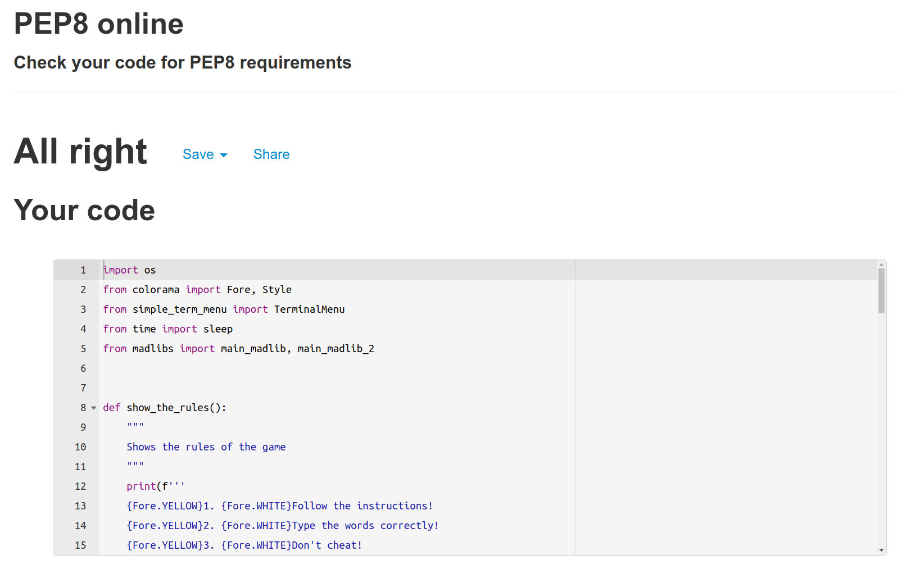
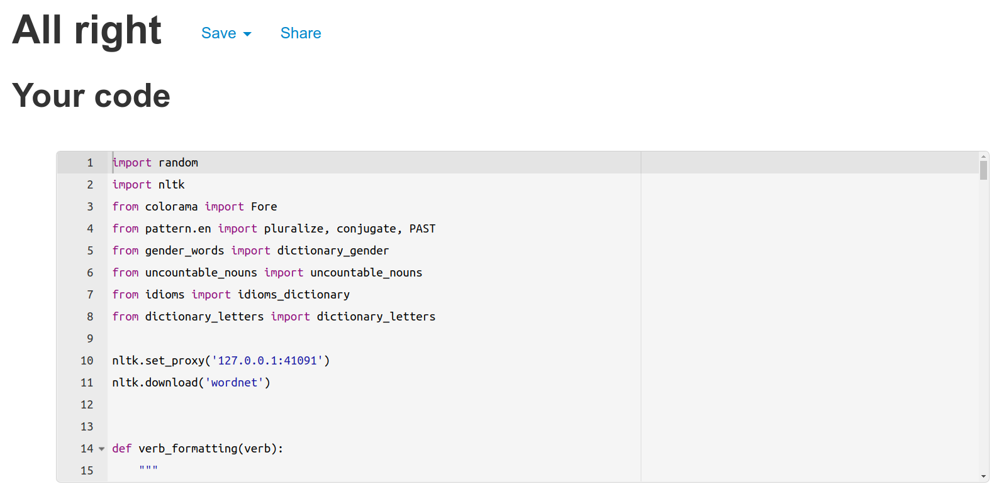
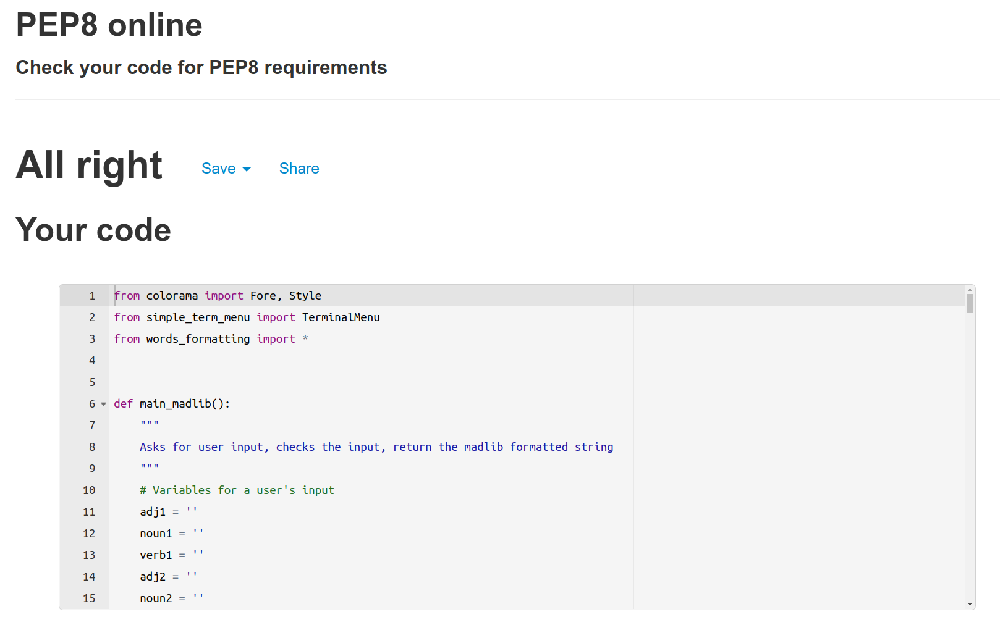
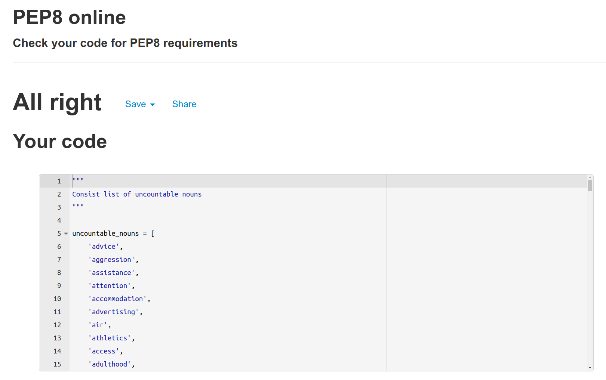
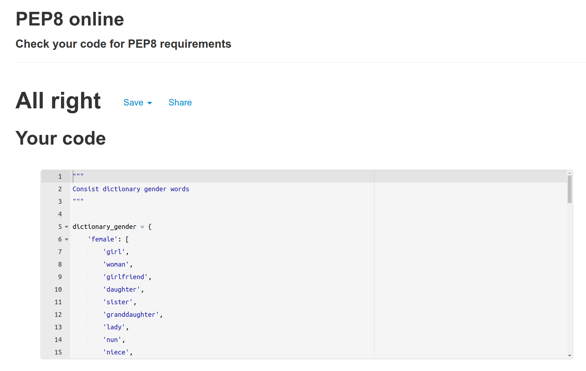
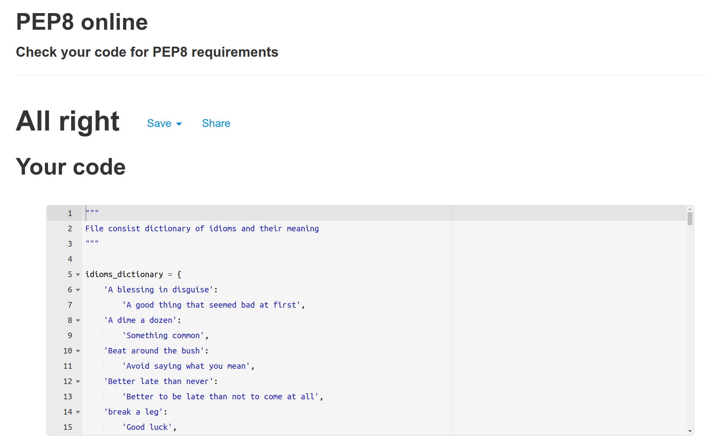
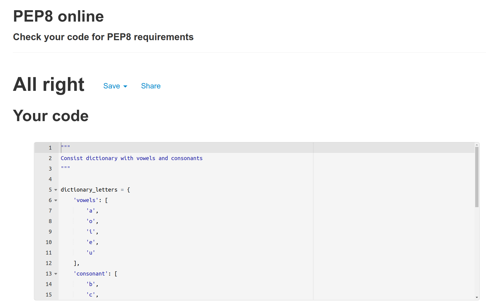

Return back to the [README.md](README.md) file.

## Testing

The program was tested constantly during its development process.
Other users also tested it in order to spot possible grammatical mistakes that the code may present.

### Validators

Valentin Bryukhanov's [online validation tool](http://pep8online.com/) was used to ensure that all of the project's Python source code is [Pep 8-compliant](https://legacy.python.org/dev/peps/pep-0008/). This checking was done manually by copying python code and pasting it into the validator.

No errors were found:

- **run.py**

- **words_formatting.py**

- **madlibs.py**

- **uncountable_nouns.py**

- **gender_words.py**

- **idioms.py**

- **dictionary_letters.py**

---